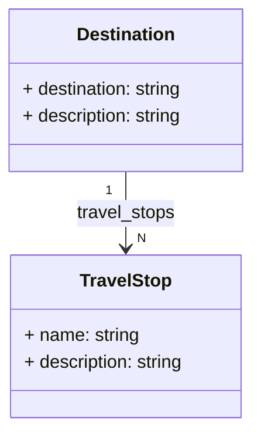

# Travels Booker

## Diagrama de Classes

```mermaid
classDiagram
  class Destination {
    + destination: string
    + description: string
  }

  class TravelStop {
    + name: string
    + description: string
  }

  Destination "1" --> "N" TravelStop : travel_stops
```